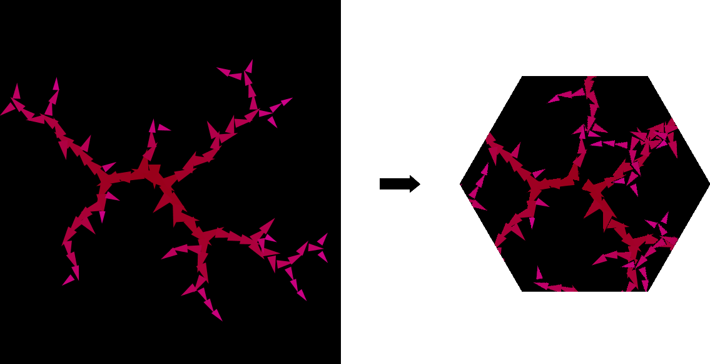

# Hexaflexaspace

This java library allows you to transform Processing sketches into image in a way that all sides that can connect in some state do connect.



There are 2 ways to use this library avalaible, directly in PApplet class orby using cli interface.

### Usage through cli

Folds given image to match on connected sides.

```java -jar hexaflexaspace.jar [input path] [output path] -s [hexaflexagon size]```

It is also possible to watch for input file changes by adding ```-w``` flag.

### Usage in Papplet

```
Hexaflexaspace hexaflexaspace;

void setup() {
  //Create new hexaflexagon object, argument is its radius (size of processing canvas has to be at least 2 times radius of hexaflexagon)
  Hexaflexagon hexaflexagon = new Hexaflexagon(200);

  //create and store hexaflexaspace (used for folding of images)
  hexaflexaspace = new Hexaflexaspace(this, hexaflexagon);
  
  //if you want to view how is image folding you can use this
  PGraphicsDisplayer hexaflexagonDisplayer = new PGraphicsDisplayer(hexaflexaspace.getFoldedHexaflexagonGraphics());
  runSketch(new String[]{"me.ienze.hexaflexaspace.display.PGraphicsDisplayer"}, hexaflexagonDisplayer);

  hexaflexaspace.update();
}

void draw() {
  background(255);
  
  translate(width / 2, height / 2);
  rotate(frameCount / 40.0f);
  strokeWeight(12);
  line(-2000, 40, 2000, 40);
  
  //call this whenever you made changes to image and want to apply them into folded image
  hexaflexaspace.update();
}
```

# Hexaflexaspace [SK]

Tato javovska kniznica umozni konvertovat sketche v Processingu do obrazkov ktore sa daju pouzit na strany hexaflexagonu. Obrazky sa poskladaju tak, aby na seba nadvezovali vsetkymi potrebnymi stranami.

Su dostupne 2 sposoby pouzitia, pomocou cli rozhrania alebo priamo pouzitim v PApplet.

### Pouzitie z cli

Zlozi vstupny obrazok tak aby potrebne strany na seba nadvezovali.

```java -jar hexaflexaspace.jar [input path] [output path] -s <hexaflexagon size>```

Taktiez je mozne sledovat vstupny subor na zmeny a aktualizovat vystup pri kazdej zmene pridanim flagu ```-w```.

### Pouzitie v PApplet

```
Hexaflexaspace hexaflexaspace;

void setup() {
  //Create new hexaflexagon object, argument is its radius (size of processing canvas has to be at least 2 times radius of hexaflexagon)
  Hexaflexagon hexaflexagon = new Hexaflexagon(200);

  //create and store hexaflexaspace (used for folding of images)
  hexaflexaspace = new Hexaflexaspace(this, hexaflexagon);
  
  //if you want to view how is image folding you can use this
  PGraphicsDisplayer hexaflexagonDisplayer = new PGraphicsDisplayer(hexaflexaspace.getFoldedHexaflexagonGraphics());
  runSketch(new String[]{"me.ienze.hexaflexaspace.display.PGraphicsDisplayer"}, hexaflexagonDisplayer);

  hexaflexaspace.update();
}

void draw() {
  background(255);
  
  translate(width / 2, height / 2);
  rotate(frameCount / 40.0f);
  strokeWeight(12);
  line(-2000, 40, 2000, 40);
  
  //call this whenever you made changes to image and want to apply them into folded image
  hexaflexaspace.update();
}
```
